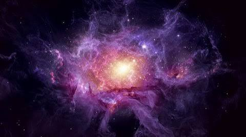

# 🌌 Cyber Onboarding & Recruitment Visualizer

> An interactive, WebGL-powered developer onboarding dashboard built with **Next.js**, **Three.js**, and **Tailwind CSS**.



---

## ✨ Features

- 🪐 **Immersive Cosmic Environment**: High-definition WebGL background with dynamic lighting and parallax motion.
- 📋 **Multi-Step Onboarding Form**: 11-field registration flow with automated client-side WebP image conversion.
- 🔒 **Fallback Architecture**: Seamless persistence pipeline with Supabase & LocalStorage redundancy.
- 🛡️ **Moderation & Admin Suite**: Complete panel to review, filter, and moderate registered developer applications.
- ⚡ **Motion Architecture**: Scroll-driven storytelling components powered by Framer Motion & Three.js.

---

## 🛠️ Tech Stack

- **Framework**: Next.js (App Router)
- **Styling**: Tailwind CSS
- **Graphics & Motion**: Three.js, WebGL, Framer Motion
- **Database & Storage**: Supabase / Local Storage Fallback
- **Deployment**: Vercel

---

## 🚀 Getting Started

```bash
# Clone the repository
git clone <your-repo-url>

# Install dependencies
npm install

# Run the development server
npm run dev